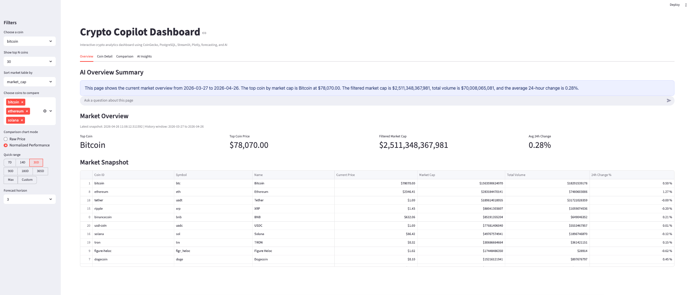
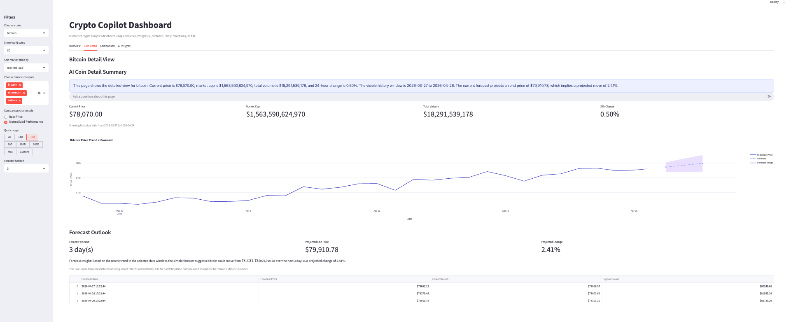
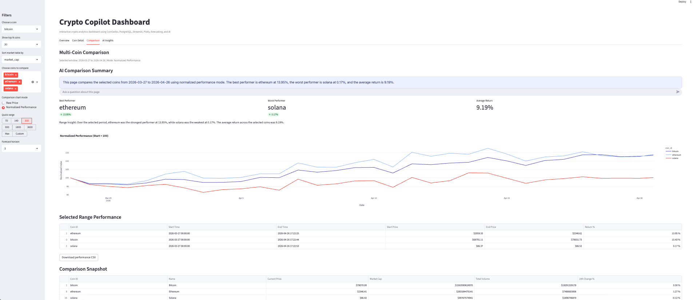

# Crypto Copilot Dashboard

An interactive crypto analytics dashboard built with Streamlit, PostgreSQL, Plotly, and OpenAI. The app allows users to explore live crypto market data, review coin-level price history, compare multiple cryptocurrencies, and ask AI-powered questions grounded in the visible dashboard context.

## Project Overview

Crypto Copilot Dashboard is an end-to-end analytics project that combines:

- data collection from the CoinGecko API
- cloud database storage in PostgreSQL
- interactive dashboard development in Streamlit
- simple trend-based forecasting
- AI-assisted Q&A based on dashboard context

The project pulls cryptocurrency market and history data, stores it in PostgreSQL, visualizes market behavior in Streamlit, and provides contextual summaries and follow-up question support through OpenAI.

## Features

- Live market overview using the latest market snapshot data
- Coin detail view with historical price trends and short-horizon forecast
- Multi-coin comparison using raw prices or normalized performance
- Date range filtering for historical analysis
- AI-powered summaries and question answering grounded in visible dashboard data
- CSV export for comparison results
- Modular project structure with separate app and script files
- PostgreSQL-backed storage suitable for local or cloud deployment

## Tech Stack

- Python
- Streamlit
- PostgreSQL
- SQLAlchemy
- Pandas
- NumPy
- Plotly
- OpenAI API
- python-dotenv
- CoinGecko API

## Project Structure

```text
crypto-copilot-dashboard/
│
├── app/
│   ├── main.py
│   └── ai_utils.py
│
├── scripts/
│   ├── create_tables.py
│   ├── fetch_coingecko_test.py
│   ├── load_market_snapshot.py
│   ├── load_multi_coin_history.py
│   ├── load_price_history.py
│   ├── load_top30_coin_history.py
│   └── test_postgres_connection.py
│
├── assets/
│   └── screenshots/
│       ├── 1.png
│       ├── 2.png
│       └── 3.png
│
├── .env.example
├── .gitignore
├── README.md
└── requirements.txt
```

## How It Works

The project uses PostgreSQL as the data layer and Streamlit as the application layer.

1. Coin market and historical price data are fetched from CoinGecko.
2. The data is stored in PostgreSQL tables.
3. The Streamlit app reads the latest market data and historical price data from PostgreSQL.
4. Users can filter, compare, and explore the data through dashboard tabs.
5. AI summaries and chat responses are generated using the current dashboard context.

## Local Setup

### 1. Clone the repository

```bash
git clone <your-github-repo-url>
cd crypto-copilot-dashboard
```

### 2. Create and activate a virtual environment

On macOS/Linux:

```bash
python3 -m venv .venv
source .venv/bin/activate
```

On Windows:

```bash
python -m venv .venv
.venv\Scripts\activate
```

### 3. Install dependencies

```bash
pip install -r requirements.txt
```

### 4. Create your environment file

Create a `.env` file in the project root using `.env.example` as the template.

Example:

```env
DATABASE_URL=your_postgresql_connection_string
OPENAI_API_KEY=your_openai_api_key_here
COINGECKO_DEMO_API_KEY=your_coingecko_demo_api_key_here
```

### 5. Set up the database

Run the database setup and data loading scripts:

```bash
python scripts/test_postgres_connection.py
python scripts/create_tables.py
python scripts/load_market_snapshot.py
python scripts/load_top30_coin_history.py
```

Optional scripts:

```bash
python scripts/load_price_history.py
python scripts/load_multi_coin_history.py
python scripts/fetch_coingecko_test.py
```

### 6. Run the app locally

```bash
streamlit run app/main.py
```

## Streamlit Cloud Deployment Notes

For deployment on Streamlit Community Cloud:

- connect the GitHub repository to Streamlit Community Cloud
- deploy from the correct branch
- add your secrets in the Streamlit app settings
- do not commit your real `.env` file to GitHub

Required deployed secrets:

```toml
DATABASE_URL="your_postgresql_connection_string"
OPENAI_API_KEY="your_openai_api_key_here"
COINGECKO_DEMO_API_KEY="your_coingecko_demo_api_key_here"
```

## Dashboard Pages

### Overview
Displays the latest market snapshot, top coin, filtered market capitalization, total volume, and average 24-hour change.

### Coin Detail
Shows the selected coin’s current metrics, historical price trend, and simple short-horizon forecast.

### Comparison
Compares multiple selected coins using raw price mode or normalized performance over the chosen date range.

### AI Insights
Provides AI-powered explanations and follow-up answers based on the current dashboard context.

## Example Questions

- What is the filtered market cap?
- How much did Bitcoin change in the last 5 days?
- Which coin performed best in this selected range?
- What does the forecast suggest for Ethereum?
- If I invested $100 based on this forecast, what would that become?

## Screenshots

### Overview


### Coin Detail


### Comparison


## Key Learning Outcomes

This project demonstrates:

- building an end-to-end analytics workflow using Python and PostgreSQL
- designing interactive dashboards in Streamlit
- structuring a modular analytics app with reusable Python utilities
- visualizing market trends with Plotly
- integrating AI into an analytics workflow using grounded app context
- adapting a local database project to a cloud PostgreSQL deployment

## Future Improvements

- automate scheduled data refresh jobs
- add stronger forecasting models
- expand AI prompt handling for more coin-specific analysis
- improve duplicate-safe historical loading with upsert logic
- convert the app into a multi-page Streamlit architecture

## Notes

This project is intended for educational, portfolio, and demonstration purposes.

The forecast functionality is a simple trend-based estimate and should not be treated as financial advice.

## Author

Chinmay Rajvanshi

MS in Business Intelligence & Analytics  
Data Analytics | BI | Product Analytics | AI-Enabled Dashboards